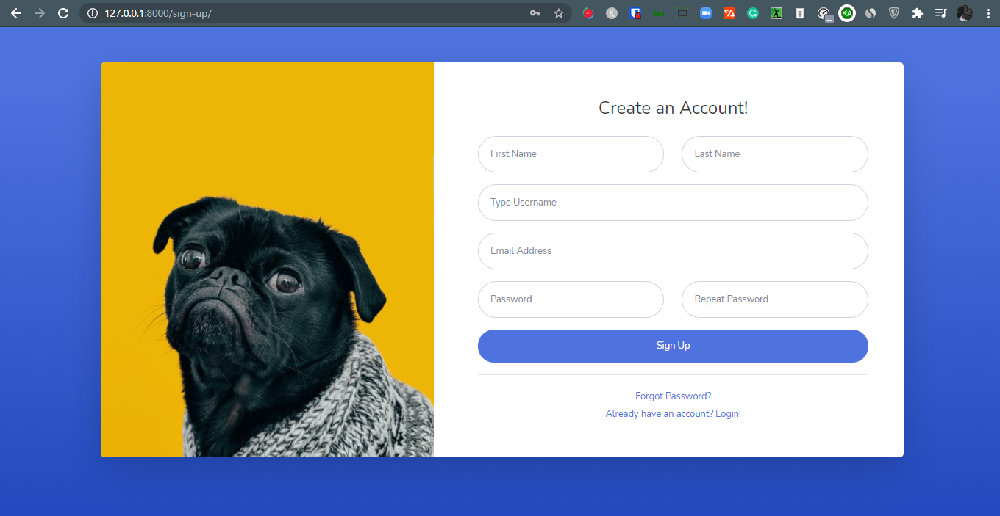
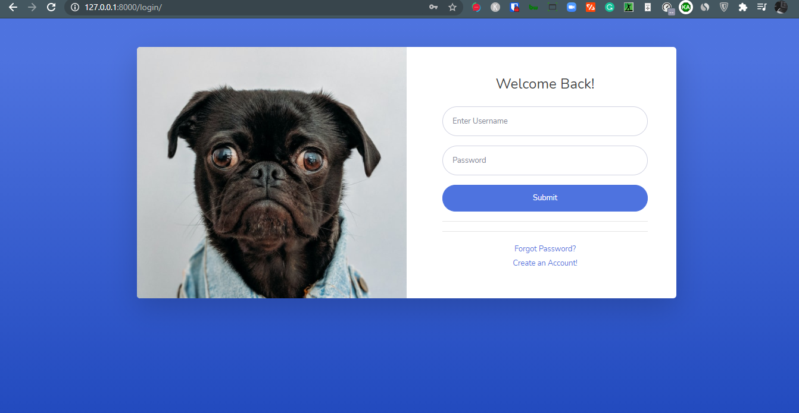

##  Multi Authors Blog Projects in Django/Python
#### Navigation : [Technology](#technology-used---)-[Project Features](#projects-features---)-[Project Images](#projects-images)-[Ower Info ](#repository-owner-info) 
  

### Technology Used : -
1. Python Web Framework Django as Backend
2. HTML, CSS & Framework BootsTrap
3. JS

### Tempaletes Used : -
1. For Frontend , Mundana BootsTrap Blog Templates. 
2. For Frontend User Admin Panel, SB Admin 2 .

#### Download both templates from below : -
1. Frontend Templates [ Mundana Bootstrap Blog ](https://www.wowthemes.net/mundana-free-html-bootstrap-template/).
2. Frontend User Admin Panel [ SB Admin 2 ](https://startbootstrap.com/theme/sb-admin-2).

### Projects Features : -

1. Dedicated Users Frontend Admin Panel.
2. Frontend Login/ Register System.
3. User`s Sides (Frontend) -
    * Users can register
    * Users can login/logout
    * Users can add Posts
    * Users can Show / Hide Posts
    * Users can edit posts
    * Users can Delete Posts
4. Admin`s Sides (Frontend) -
    * Admins can add posts.
    * Admins can add Categories
    * Admin can edit posts.
    * Admin can edit categories
    * Admin can delete Posts
    * Admin can delete categories 
    * Admin can add users and delete users
    * Admin can make posts Features
    * Admin can Approve or Pending posts
5. Blog Posts Features - 
    * Blog`s Menu shows categories with most posts under them. Highest to Lowest.
    * Posts are showing by Featured,by Recently added,by Categories, by most views count
    * Only the Active/Approved ,not the pending post, will show.
    * Each Post has Visit Count.
    * Post can be featured or popular by most views counts and comments.
    * Each post has comment features.
6. Has Subscription System to collect Emails for further email marketing .
7. Releted posts by users.
8. Search Facility .
9. Dedicated Single Category page by ( featured, popular, recent added).
10. Social Shares System.

### Projects Images 

#### User Register page

#### Users Login Page

### Repository Owner Info 

__Md. Nazrul Islam Yeasin__  
__Email :__ [ naz.yeasin@gmail.com ](mailto:naz.yeasin@gmail.com)  
__Github :__ [yeazin](https://github.com/yeazin) 
__FaceBook :__ [Yea Sin](https://facebook.com/yeariha.farsin)  
__Linkedin :__ [Yea Sin](https://www.linkedin.com/in/yeazin/)
 
 

[Go To Top ↑ ](#multi-authors-blog-projects-in-djangopython)  

